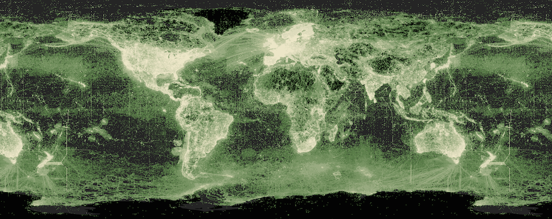

This microsite is a place to collate information on data quality, in the sense that this applies to large biodiversity databases. Currently in it's early stages, it was created to store learnings made during my [Churchill Fellowship](https://www.churchilltrust.com.au/fellow/martin-westgate-act-2025/), which focusses on ways to address [challenges in biodiversity informatics](https://www.churchilltrust.com.au/project/to-investigate-global-scale-solutions-in-biodiversity-informatics/).

For a more structured, considered, and generally coherent introduction to the topic, see the [Cleaning Biodiversity Data in R](https://cleaning-data-r.ala.org.au) book, by Dr Dax Kellie and colleagues.

<figure class="figure">
  
  <figcaption>Heatmap of occurrences in GBIF, April 2026</figcaption>
</figure>